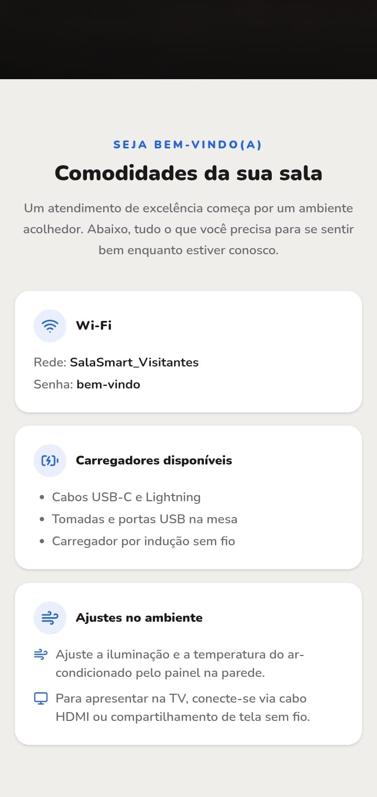
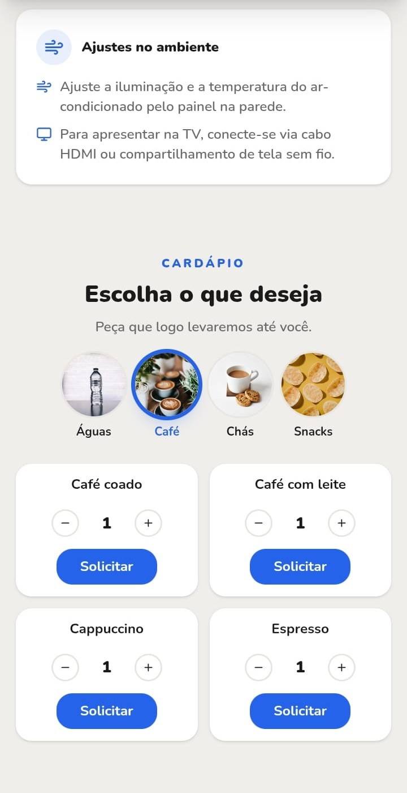
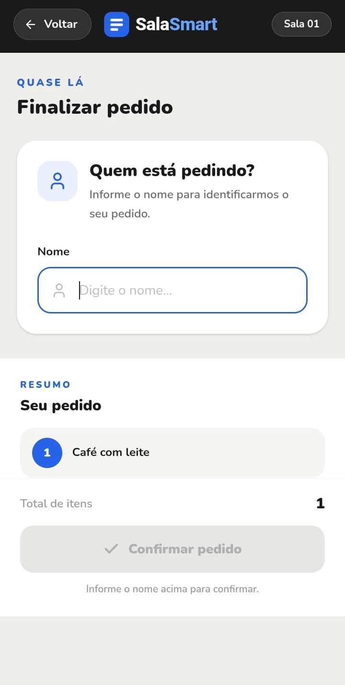
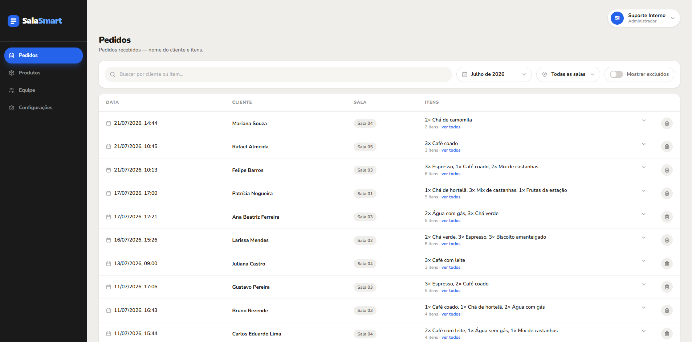
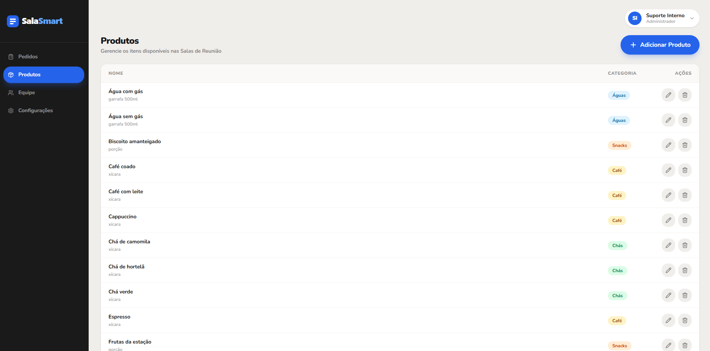

# ☕ SalaSmart — Pedidos das Salas de Reunião

Sistema de autoatendimento para pedidos de consumo dentro das salas de reunião: o usuário monta o pedido e a equipe gerencia catálogo e histórico por um painel com login — com trilha de auditoria.

## 🖼️ Preview do Sistema

### 📱 Salas (celular)

| Tela inicial | Informações da sala | Cardápio | Finalizar pedido |
|:---:|:---:|:---:|:---:|
|  |  |  |  |

### 🖥️ Painel de Gestão (desktop)

| Gestão de pedidos | Gestão de produtos |
|:---:|:---:|
|  |  |

## Funcionalidades Principais

- **Pedido por Sala** - Cada pedido é gravado com a sala de origem (nome + itens + sala)
- **Notificação via WhatsApp** - Ao confirmar, abre uma mensagem pronta para dar ciência à equipe
- **Painel de Gestão** - Catálogo de produtos, categorias, equipe de acesso e histórico em um só lugar
- **Histórico com Auditoria** - Filtros por mês, sala e nome, com exclusão lógica registrando autor, motivo e data
- **Controle de Acesso** - Autenticação por usuário e senha com sessão em JWT (cookie httpOnly)

## Tecnologias Utilizadas

**Frontend:** React, TypeScript, Tailwind CSS, Vite\
**Backend:** NestJS (Node.js), Prisma, PostgreSQL

## Destaques Técnicos

- Arquitetura frontend/backend separados
- API RESTful com autenticação JWT e controle de acesso por papéis
- Interface responsiva pensada para uso em tablet (quiosque) e desktop (gestão)
- Segurança por padrão (Helmet/CSP, CORS explícito em produção, cookie httpOnly)
- ORM Prisma sobre PostgreSQL com exclusão lógica e trilha de auditoria

## Objetivo do Projeto

Desenvolver uma solução completa de autoatendimento que demonstra habilidades em:
- Desenvolvimento full-stack
- Modelagem de regras de negócio e segurança de aplicação
- UI/UX moderno e responsivo
- Gestão de estado complexo e integração via API

---

*💡 Portfólio focado em demonstrar capacidades técnicas e de desenvolvimento*
